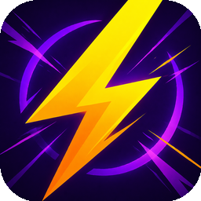
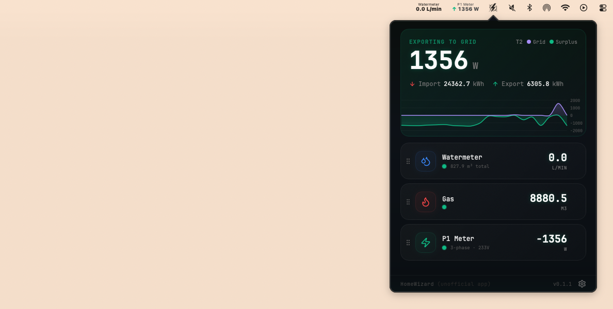

# HWTray

A lightweight macOS tray app for monitoring HomeWizard Energy devices on your local network.

- Real-time power, gas, and water monitoring from the system tray
- Auto-discovers HomeWizard devices on the local network via mDNS
- Works with P1 Meter, Energy Socket, Watermeter, kWh Meter (1P/3P), and ESD (SDM230/SDM630)

[`download`](https://github.com/eduardostuart/hwtray/releases/latest) · [`development`](docs/DEVELOPMENT.md) · [`security`](./SECURITY.md) · [`license`](./LICENSE)

> _This is an unofficial project, not affiliated with, endorsed by, or sponsored by HomeWizard B.V. "HomeWizard" is a trademark of its respective owner and is used here only to describe compatibility._

 

## Author

[Eduardo Stuart](https://s.tuart.dev)
